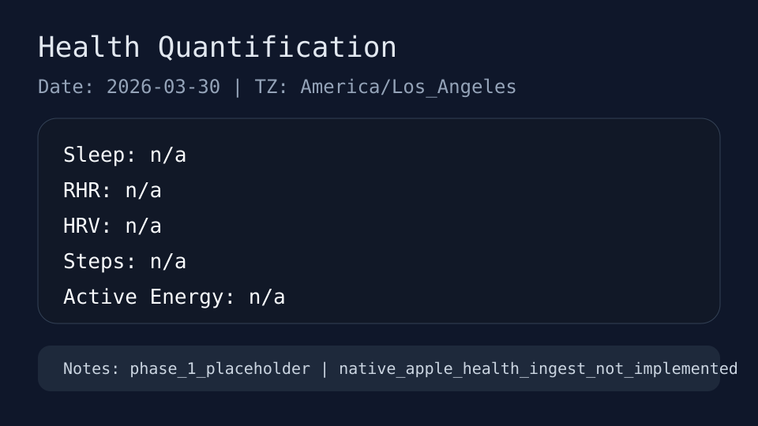
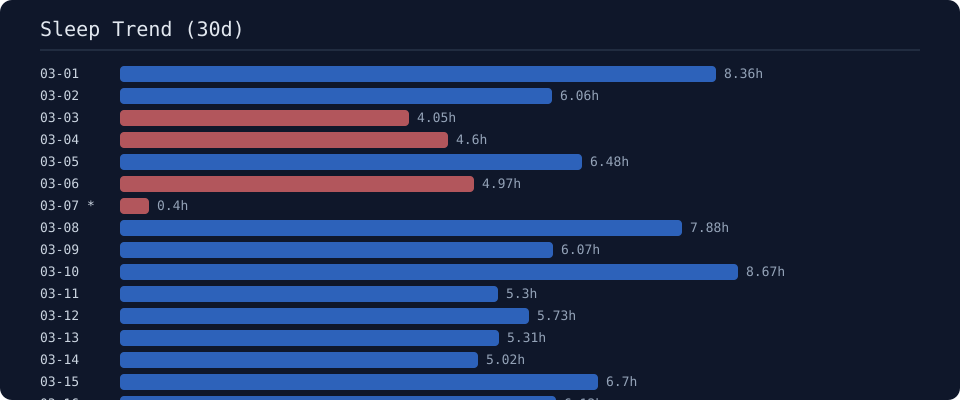
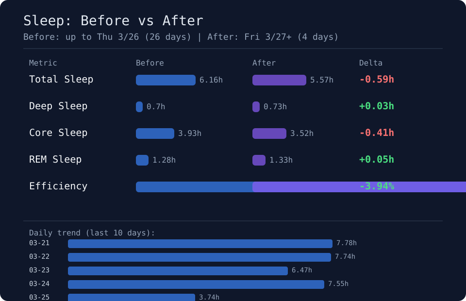

# Health Quantification

AI-first 个人健康量化基础设施。通过 iOS App 采集 Apple Health 数据，经 FastAPI 服务归一化并幂等落盘至 SQLite，提供 Python CLI 进行结构化数据查询与记录管理。数据分析与报告生成完全由 AI 驱动。

AI 编程工具（如 Claude Code、Cursor、OpenCode）读取 `AGENTS.md` 和 Skill 文件后，即可自主完成环境配置、数据库初始化、数据查询与报告分析。

## 系统架构

采用三层解耦架构：

```text
iPhone (HealthKit) --POST--> Mac (FastAPI:7996) --write--> SQLite (唯一事实来源)
                                                        --read--> CLI (JSON) --> AI Agent
```

- **采集层**：iOS App 从 HealthKit 读取数据，并通过同一 Tailnet 的 Tailscale 地址 POST 至 Mac。
- **写入层**：FastAPI 后端只负责批量接入与幂等写入 SQLite。设备身份、传输加密和访问控制由 Tailscale 与 tailnet ACL 管理，不由 FastAPI 实现。
- **分析与交互层**：Python CLI 在 Mac 本地读取 SQLite，或执行单条数据/备注写入；AI Agent 在本地 CLI 输出基础上分析与渲染。

## 输出示例

项目包含几张示例图，展示 AI 如何将 CLI 的结构化输出组织成日卡片、趋势图和前后对比。它们是仓库展示素材，不会在本地同步或测试流程中覆盖。







## 数据类型与指标映射

CLI 查询与写入参数中，`--metric` 必须使用数据库存储的精确名称。`GET /ingest/{data_type}` 的 `metric_type` 过滤参数仅适用于生命体征、体测、生活方式与活动；睡眠数据按 `stage`，运动数据按 `workout_type`。

| 类别 | 指标类型 (`metric_type`) | 单位 | 来源与采集方式 |
|------|-------------------------|------|----------------|
| 睡眠 | `asleep_deep`, `asleep_core`, `asleep_rem`, `awake` | stage | Apple Watch 自动采集 |
| 生命体征 | `resting_heart_rate`, `heart_rate_variability_sdnn`, `respiratory_rate`, `oxygen_saturation`, `heart_rate`, `active_energy_burned` | count/min, ms, %, kcal | Apple Watch 自动采集 |
| 活动 | `step_count` | count | Apple Watch / iPhone 自动采集 |
| 体测 | `body_mass`, `blood_glucose`, `blood_pressure_systolic`, `blood_pressure_diastolic` | kg, mg/dL, mmHg | 智能秤 / CGM / 蓝牙血压计 |
| 生活方式 | `dietary_caffeine`, `dietary_alcohol` | mg, g | HealthKit 同步 / CLI 手动记录 |
| 运动 | Apple Health `HKWorkoutActivityType` 名称 | - | Apple Watch 结构化运动 |

## 快速开始

### 环境依赖

- macOS + Xcode（项目配置的目标平台为 iOS 26.2，用于编译 iOS App）
- Python 3.11+ 与 `uv` 包管理器
- iPhone 与 Apple Watch（数据采集）
- Apple Developer 账号（真机调试 HealthKit）
- 同一 Tailnet 中已通过 ACL 允许互访的 iPhone 与 Mac

### 配置与运行步骤

1. **环境准备与数据库初始化**：

   ```bash
   uv venv .venv
   uv pip install --python .venv/bin/python -e .[dev]
   .venv/bin/python -m health_quantification.cli doctor config
   .venv/bin/python -m health_quantification.cli db init
   ```

2. **启动后端服务**：

   ```bash
   scripts/start_backend.sh
   ```

    默认监听 `0.0.0.0:7996`，可通过 `HEALTH_QUANT_SERVER_HOST` 与 `HEALTH_QUANT_SERVER_PORT` 覆盖。后端没有应用层鉴权，部署模型是仅允许同一 Tailnet 中受 ACL 控制的 iPhone 通过 Tailscale 连接同步；不要把端口暴露到公网或普通 LAN。验证 Mac 本地服务：`curl http://localhost:7996/health`。

3. **编译并配置 iOS App**：
   - 打开 `HealthQuantification/HealthQuantification.xcodeproj`。
   - 在 Xcode Signing & Capabilities 中配置开发 Team，并将 Bundle Identifier 修改为自定义命名空间。
   - 在真机上运行，授权 HealthKit 访问权限。
    - 将 App 内的 Server URL 设置为 Mac 的 Tailscale 地址（如 `http://100.x.x.x:7996`），请勿使用 `localhost` 或普通 LAN IP。
   - 首次配置详细说明参见 [`docs/first_time_ios_developer.md`](docs/first_time_ios_developer.md)。

4. **数据同步入口与数据边界**：
   - App 内点击 **Export All Data** 执行全量同步。
   - FastAPI Ingestion 端点对 `samples` 校验 `min_length=1`，会直接拒绝空样本数组（422 错误）。目前 iOS 客户端在 `body` 和 `lifestyle` 无样本时主动跳过提交，而其余类别仍会提交空数组触发 422。空类别与缺失数据处理属于需要客户端预校验的边界，并非全类别自动容错。
   - 支持 Shortcuts 快捷指令触发导出，快捷指令添加 Open URL 动作：

     ```text
     healthquantification://export-all
     ```

   - 支持带一次性 callback 的跨 App 导出 handoff：

     ```text
     healthquantification://export-all?callback=<percent-encoded-opencode-callback>
     ```

     规范说明参见 [`docs/ios_client_export_rfc.md`](docs/ios_client_export_rfc.md)。

## CLI 交互规范

（以下所有 CLI 命令与 JSON 响应示例均使用合成示例数据）

### 结构化查询

```bash
python -m health_quantification.cli doctor config
python -m health_quantification.cli db init
python -m health_quantification.cli sleep analyze --days 30 --format json
python -m health_quantification.cli sleep daily --date 2026-03-30 --format json
python -m health_quantification.cli sleep daily --last-night --format json
python -m health_quantification.cli vitals analyze --days 30 --metric resting_heart_rate --format json
python -m health_quantification.cli body analyze --days 30 --metric body_mass --format json
python -m health_quantification.cli lifestyle analyze --days 30 --metric dietary_caffeine --format json
python -m health_quantification.cli activity analyze --days 30 --metric step_count --format json
python -m health_quantification.cli workouts analyze --days 30 --format json
```

### 睡眠主观备注 (Sleep Notes)

```bash
python -m health_quantification.cli sleep notes add --date 2026-03-30 --note "合成示例主观睡眠上下文"
python -m health_quantification.cli sleep notes get --date 2026-03-30 --format json
```

`sleep daily` 和 `sleep analyze` 命令会自动输出同日 `notes`。主观备注仅存储在本地 SQLite 的 `daily_summaries` 中（主键为 `date`），不参与 FastAPI 传输与 iOS 导出，亦不影响睡眠阶段判定或指标计算。由于 CLI 会输出备注文本，模型运行时、系统日志、transcript 与报告 pipeline 构成了调用方的隐私边界。代码并不阻止备注传至外部模型或服务，调用方需自行承担隐私保护责任。主观备注仅作为上下文，不代表医疗诊断或治疗指令。

### 单条记录与状态记录

```bash
python -m health_quantification.cli record lifestyle --metric dietary_caffeine --value 150 --unit mg --note "Synthetic double shot"
python -m health_quantification.cli illness record --label nasal_congestion --severity moderate --status active --start-time "2026-04-01T20:00:00-07:00"
python -m health_quantification.cli illness list --status active --format json
```

注意：`record sleep` 因缺少结束时间会写入零时长的阶段标记，不推荐用于手动睡眠时长记录；添加主观睡眠体验请使用 `sleep notes add`。

## 隐私与安全约定

- 本仓库为公开代码库。禁止提交真实个人健康测量值、生理特征、地理位置、姓名、私人设备标识或绝对路径。
- 所有数据落盘文件（`data/*.db`）、导出记录、报告文档与临时文件均处于 `.gitignore` 排除范围。
- 新增与修改的测试与文档示例必须采用合成（synthetic）数据。
- 自由格式主观备注为本地记录，不作医疗诊断依据。CLI 会输出同日 notes；调用方必须避免将其写入公共 Artifact、外部服务或不受控的模型上下文。

## 非目标

- 不提供面向公众分发的 App Store 版本及 GUI 产品。
- 不从 Python 层直接调用 HealthKit。
- 不提供实时告警或医疗诊断功能。
- 不在 FastAPI 后端提供复杂分析接口（分析逻辑均由 CLI 与 AI 完成）。
- 不提供全流程 iOS 到 FastAPI 的端到端自动化集成测试（Swift 单元测试与 Python ASGI 测试保持解耦）。
